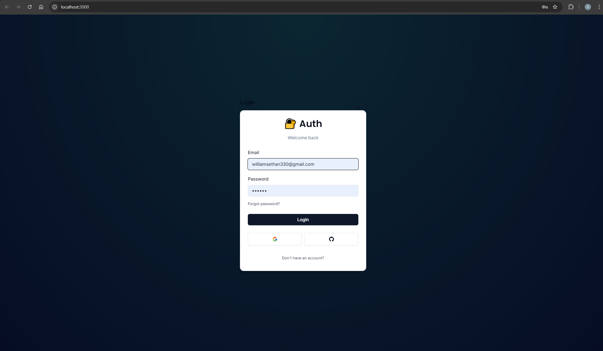
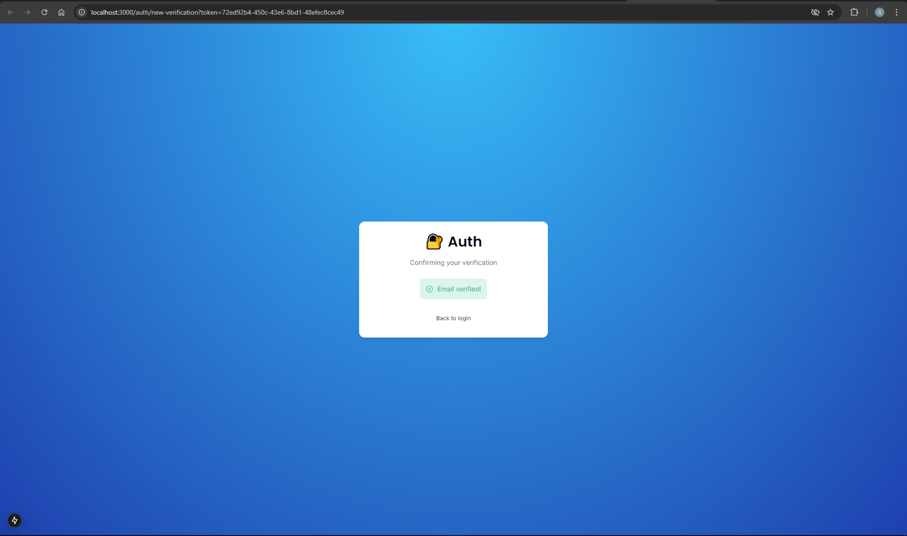
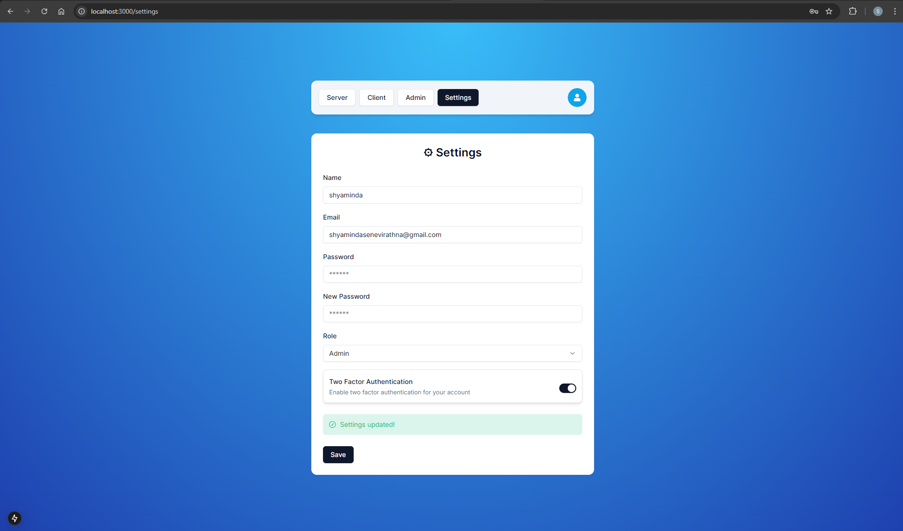
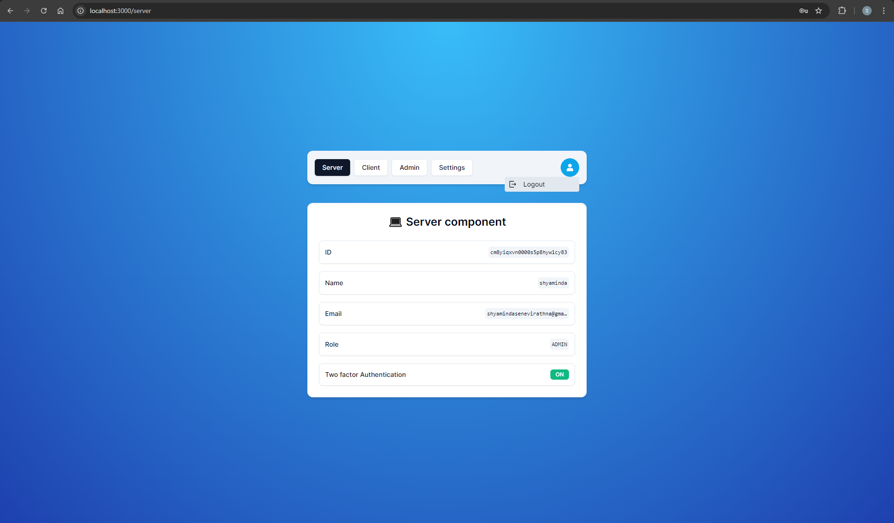
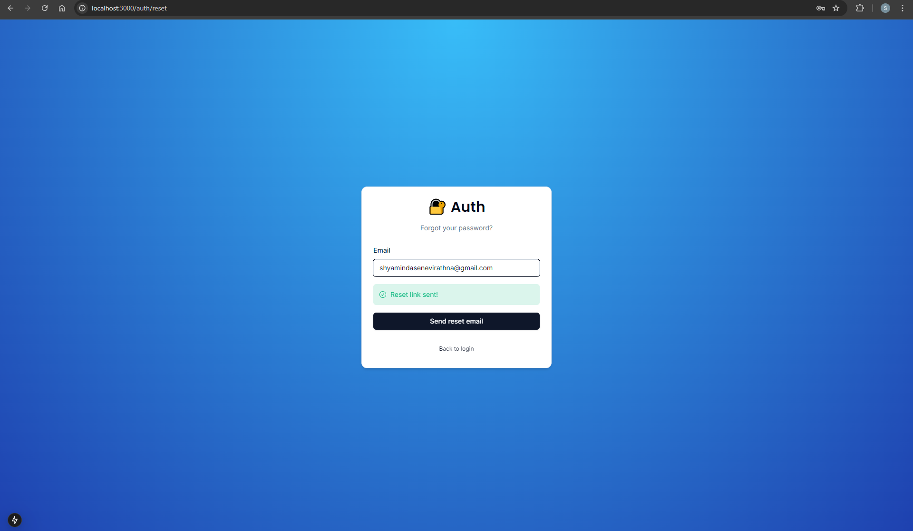

# Next-Auth 


## 📌 About the Project

A comprehensive authentication customizable showcase using NextAuth v5 (Auth.js) and Next.js 14 with server actions. The project demonstrates various authentication and authorization features, including social login, email verification, two-factor authentication, and role-based access control.

---

## 📸 Project Screenshots

<details>
  <summary><strong>Social Login</strong></summary>
  
</details>

<details>
  <summary><strong>Email verification</strong></summary>
  
</details>

<details>
  <summary><strong>2FA</strong></summary>
  
</details>

<details>
  <summary><strong>Role Base Access</strong></summary>
  
</details>

<details>
  <summary><strong>Reset Password</strong></summary>
  
</details>

---

## 📑 Index

- [Features](#-features)
- [Built With](#-built-with)
- [Installation](#-installation)
- [How It Works](#-how-it-works)
- [Support](#-support)
- [License](#-license)

---

## 🚀 Features

✅ **Authentication & Authorization**
- NextAuth v5 (Auth.js) with Next.js 14
- Credentials Provider (Email & Password Login)
- OAuth Provider (Google & GitHub Login)

✅ **Security & Account Management**
- Forgot Password Functionality
- Email Verification for New Users
- Two-Factor Authentication (2FA)
- Change Email with New Verification
- Change Password with Old Password Confirmation

✅ **Role-Based Access Control**
- User Roles (Admin & User)
- Render Admin-Only Content with `RoleGate` Component
- Protect API Routes for Admins Only
- Protect Server Actions for Admins Only

✅ **User Settings & Control**
- Enable/Disable Two-Factor Authentication
- Change User details

---

## 🛠 Built With

- **Framework**: Next.js 14 (with Server Actions)
- **Authentication**: NextAuth v5 (Auth.js)
- **Database**: Prisma ORM
- **UI Components**: ShadCN/UI

---

## 📦 Installation

### Running Locally

#### 1️⃣ Clone the repository

```sh
git clone https://github.com/Shyaminda/next-auth.git
cd next-auth
```

#### 2️⃣ Install dependencies

```sh
npm install
```

#### 3️⃣ Set up environment variables

Copy `.env.example` to `.env` and configure the following:

```env
DATABASE_URL="your-database-url"
AUTH_SECRET="your-secret"
NEXTAUTH_URL="http://localhost:3000"
GOOGLE_CLIENT_ID="your-google-client-id"
GOOGLE_CLIENT_SECRET="your-google-client-secret"
GITHUB_CLIENT_ID="your-github-client-id"
GITHUB_CLIENT_SECRET="your-github-client-secret"
RESEND_API_KEY="resend API key"
```

#### 4️⃣ Generate and migrate Prisma database

```sh
npx prisma generate
npx prisma migrate dev
```

#### 5️⃣ Start the development server

```sh
npm run dev
```
Your application will run at [http://localhost:3000](http://localhost:3000) 🚀

---

## 🔍 How It Works

1️⃣ **User Authentication**
   - Users can sign up using credentials or social login (Google/GitHub).
   - Email verification is required for new accounts.

2️⃣ **Security Features**
   - Users can enable 2FA in settings.
   - Password resets and email changes require verification.

3️⃣ **Admin Controls**
   - Admins can access protected pages.
   - Role-based access management using `RoleGate`.

---

## 💡 Support

If you find this project useful, please consider giving it a ⭐ on GitHub.

---

## 📝 License

MIT License – Free to use and modify.

